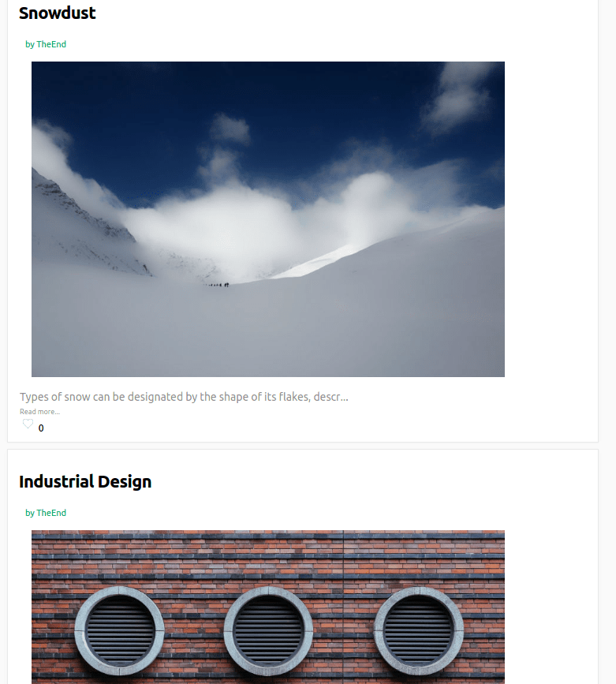

# Connect

Connect live:
[View Live Site][heroku]
[heroku]: https://connect-app.org/

Connect is a full--stack web app based on Medium. The backend runs on Ruby on rails, with a PostgreSQL database and React/Redux framework on the frontend to ensure a seamless user experience.

## Features & Implementation

## Story Creation and Editing

Stories are stored in the database, linked to the author with a foreign key for user_id. My database structure differs from the way in which, I later realized Medium handled stories and responses -- in that, I have separate objects for them. On Medium all responses are stories too. Which is a pretty interesting way to organize things. Stories displayed in the feed are based off of which users a the logged in user follows. Follows are a join table of author_ids and follower_ids which I use on the front-end to select which stories to display. This feature will be a bit more useful once I have search up and running. of this project is somewhat complicated in that users can follow other users, topics, categories, while also writing stories which can be linked to specific tags and so on. Stories displayed in the feed will be based on the tags that the user follows, using that tag_follows table to link users to stories through the tags table. This specific group of stories will persist until the user logs out. I also plan on implementing an infinite scroll if I have enough time.

Stories are displayed in two different components, StoriesContainer - which shows the title, description, image, and estimated read-time of the story, and StoryDetailContainer which displays the entire body of the story, its images, and highlights. At the bottom of StoryDetailContainers there is space for users to comment. The StoryIndex houses most of the components. Each StoryDetailContainer has like, follow, and comment buttons. At the top of the StoriesIndex there is also a component for writing a new story, which will soon expand into a full-size rich text editor. I'm choosing between Quill.js and Draft.js to address this. The UI of Connect is adopted from Medium, a site whose functionality is as equally polished as its appearance.

## Likes

Likes are a table in the database which have two foreign keys: user_id and tag_id. Each like is handled in the ruby back-end a bit differently that other objects in that I return a new story object so that that will hit the reducer and update the state, thereby triggering a re-render. Since likes live within stories this made sense rather than introducing a new slice of state.

## Component Structure

Much of the site is nested within the header or sidebar( still in development). Most of the user functionality (posting, adjusting followed tags, and searching) lives in the header, which will be rendered as a subcomponent of the index or ExpandedStoryContainer pages.

## Future Directions for the Project

In addition to the features already implemented, I plan to continue work on this project. The next steps for Connect are outlined below.

- [ ] Add Rich Text Editing
- [ ] Add Infinite Scroll
- [ ] Add Tags

## Publications

Publications are another key feature of Medium. They allow specific magazines or blogs to create their own branded namespace within Medium. I plan to expand the features of categories into a full-fledged publication feature.

Expanded inline quoting and commenting

This is another hidden but brilliant feature of Medium -- users can select sections of text which they find interesting and comment on it to other users. These comments can either be public or solely addressed to the author. Live notifications of these sorts of events would also be very interesting to pursue.
